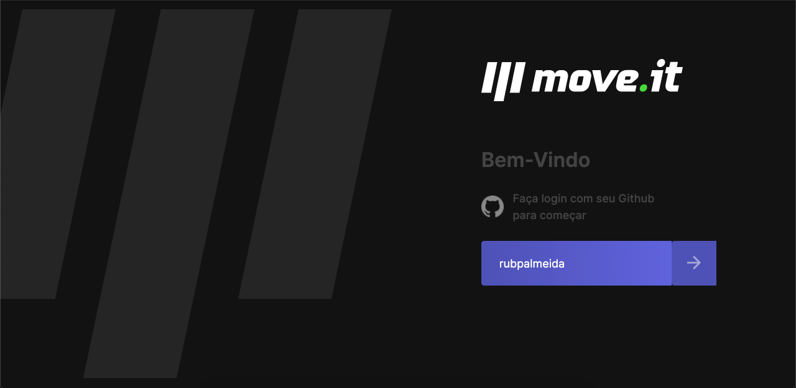
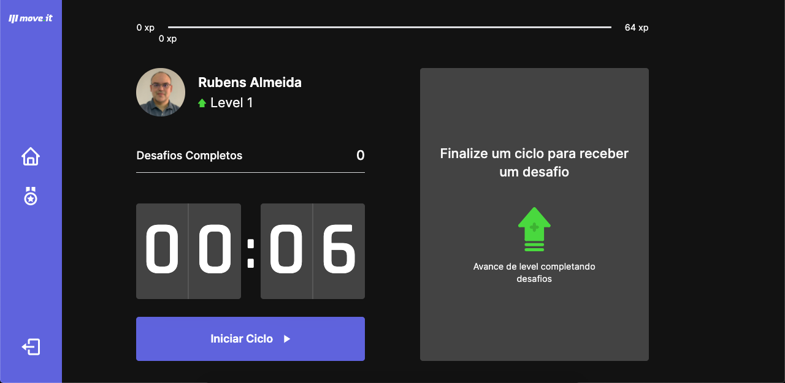
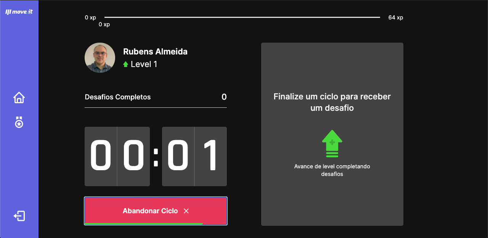
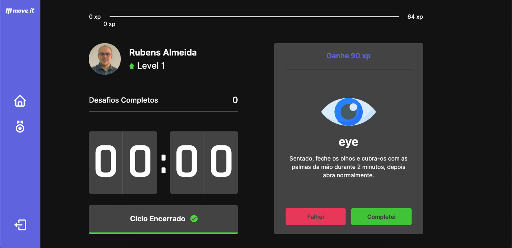
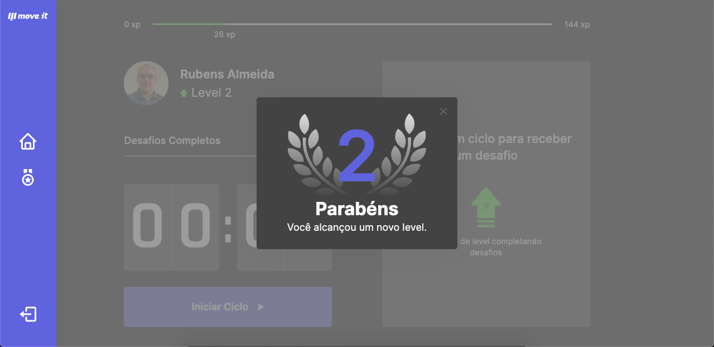
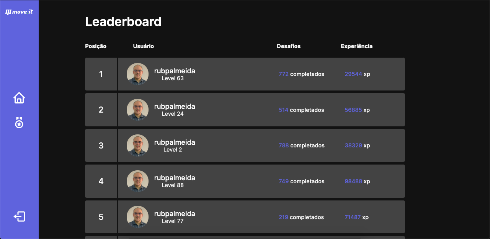

# Move It

This application was created during an event called Next Level Week, in its 4th edition, this was a Rocketseat`s event. This application is to stimulate devs who spend a lot of time in front of computers to do some exercises using a time management method called Pomodoro.

## 🚀 Thecnoligies

- [TypeScript](https://www.typescriptlang.org/)
- [NextJS](https://nextjs.org/)
- [ReactJS](https://reactjs.org/)
- [HTML](https://developer.mozilla.org/pt-BR/docs/Web/HTML)
- [CSS](https://developer.mozilla.org/pt-BR/docs/Web/CSS)
- [Yarn](https://yarnpkg.com/)

### 🔨 How to use
- Clone this repository;
- `yarn` to install the dependencies
- `yarn dev` to run in a development environment.

### 💻 Project.

This project is hosted on Vercel at the following [link](https://moveit-rubpalmeida.vercel.app/).
Below are some pictures from the project, the dark theme was implemented using user preferences.

### 📈 how to contribute?
- Fork this repo;
- Create a branch with your feature: `git checkout -b my-feature`
- Commit the chagens: `git commit -m 'feat: My new feature'`
- Push branch: `git push origin my-feature`
